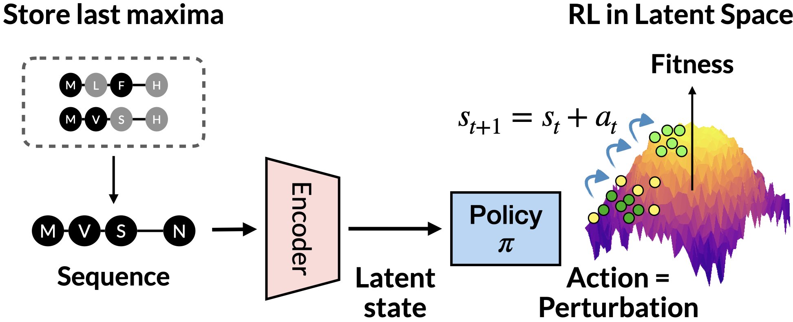

# LatProtRL (ICML 2024)
This repository provides an official implementation of "Robust Optimization in Protein Fitness Landscapes Using Reinforcement Learning in Latent Space", presented in ICML 2024. We provide model checkpoints, implementation of baseline algorithms, and figure reproduction as well. Paper: https://arxiv.org/abs/2405.18986



## Getting Started
Setup the environment. Please note that below installs PyTorch 2.1.2 for CUDA toolkit 11.8.
```
conda create -f env.yml
```
Please setup `wandb` account for logging functionalities.

### Fitness optimization benchmark
The required dataset and checkpoints of fitness optimization benchmark proposed in [GGS](https://github.com/kirjner/GGS) are already included in the repository, under directory `data` and `ckpt`.

### Download pretrained weights 
- Download 650M ESM-2 weights from [here](https://dl.fbaipublicfiles.com/fair-esm/models/esm2_t33_650M_UR50D.pt) and place under `ckpt/`
- Download our variant encoder-decoder (VED) weights from [Google Drive](https://drive.google.com/drive/folders/1_1dsP_9xU4Y6nPMk4317CuIOEYxK3gwI?usp=sharing) and place under `saved/`

## Optimize 
```
python optimize.py --protein [PROTEIN] --level [LEVEL] --device [DEVICE] --run [RUN] --use_oracle
```

| Parameter | Type | Description | Options | Required | Default |
|--|--|--|--|--|--|
|`protein`|string|Target protein|GFP, AAV|✔️||
|`level`|string|Level of the task|hard, medium|✔️||
|`device`|string|Device to use||✔️||
|`run`|int|Index of the run for the log file.|||0|
|`max_step`|int|Episode length|||None|
|`not_sparse`|store_true|Provide reward every step|||False|
|`use_oracle`|store_true|Use oracle when fitness evaluation|||False|
|`delta`|float|$\delta$ i.e. perturbation magnitude|||None|
|`step_mut`|int|$m_\text{step}$ i.e. maximum number of mutation per step|||3|
|`tag`|str|Tag for wandb project|||None|

`delta` and `max_step` follow the value in `config.py` when `None` i.e. not specified. If `use_oracle` use oracle (Tab 2. setting), else use predictor (Tab. 3 setting). Please set `not_sparse` if not `use_oracle`.

### Logs
Under `results/[RUN NAME]`, Our experiment automatically save optimized sequences as `.npy` file and corresponding evaluation metrics as `.txt` file each round. `[RUN NAME]` is formatted as `[PROTEIN]_[LEVEL]_[RUN]_[Local Time]`. 

### Summarize log
`summarize.py` loads the `.npy` file and evaluate sequences, saving the results in `summary/ours`. This assumes 15 rounds and run index 0-4 (total 5 runs).

## Run baseline
Baseline algorithms are under `baseline` directory. Code is adapted from [FLEXS](https://github.com/samsinai/FLEXS) and [PEX](https://github.com/HeliXonProtein/proximal-exploration) official github. 
```
python run_baseline.py --protein [PROTEIN] --level [LEVEL] --device [DEVICE] --alg [ALG]
```
| Parameter | Type | Description | Options | Required | Default |
|--|--|--|--|--|--|
|`protein`|string|Target protein|GFP, AAV|✔️||
|`level`|string|Level of the task|hard, medium|✔️||
|`alg`|string|Optimization algorithm| `bo`, `pex`, `cmaes`, `cmaes_latent`, `adalead`, `ada_latent`|✔️||
|`device`|string|Device to use||✔️||
|`seed`|int|Random seed **and** the index of the run for the log file|||0|
|`rounds`|int|Number of optimization rounds|||15|

- `cmaes_latent` and `ada_latent` are CMAES and AdaLead explorer using our encoder-decoder. 
- Running this code creates directory named `[ALG]` and save the log for each round and summary in `.csv` format under the directory. 


## Aggregate and Visualize Results 
`aggregate.py` merges the results of 5 runs and calculate other evaluation metrics, saving the results in `summary/[ALG]/[PROTEIN]_[LEVEL]_total.csv`. This is common to our summary files and baseline summary files. You can reproduce our Figures 3 and 5 using `visualization.ipynb`. Download the summary files required to reproduce visualization from [Google Drive](https://drive.google.com/file/d/1no3um9VcSBkhzMLpGNWsbzr7ea_5TYOO/view?usp=sharing).

## Train VED
You may train VED on your own from ESM-2 weights following the commamd below.
```
python train_seq.py --protein [PROTEIN] --level [LEVEL] --device [DEVICE] --batch [BATCH SIZE] -r [REDUCE DIM] 
```
| Parameter | Type | Description | Options | Required | Default |
|--|--|--|--|--|--|
|`protein`|string|Target protein|GFP, AAV|✔️||
|`level`|string|Level of the task|hard, medium|✔️||
|`device`|string|Device to use||✔️||
|`batch`|int|Batch size||✔️||
|`augment`|int|Number of augmentation|||4|
|`reduce_dim`|int|Dimension of latent state||✔️||
|`num_trainable_layers`|int|Number of trainable initial layers|||4|

`[REDUCE DIM]` is 32 for GFP and 16 for AAV in our paper.

## Todo

- [ ] Add description for number of optimization rounds and total timesteps.
- [x] Upload VED checkpoints in Google Drive
- [x] Upload summary files for visualization in Google Drive
- [ ] Add description for state/action ablation
